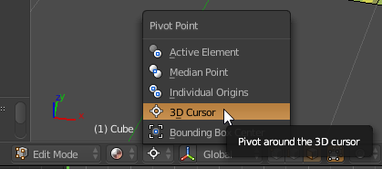
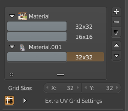
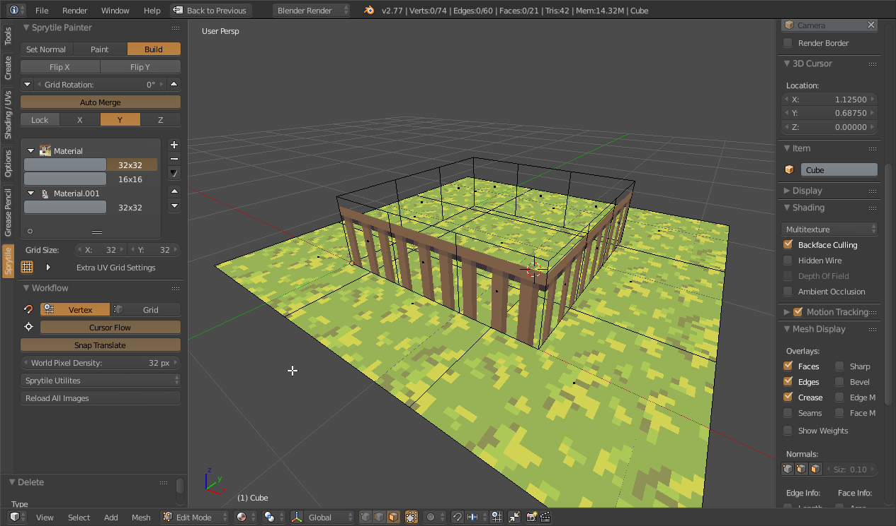

# Advanced Features

This tutorial covers additional Sprytile features not covered in the quick start guide.

## Paint Panel

### Building Off Axis

The build tool is not limited to the global X/Y/Z axis. The `Set Normal` button lets you to pick a face normal to use the build tool with.

Paint ground tiles like shown below, with one tile sticking out, and move the 3D cursor to the indicated vertex.

Set the pivot point mode to 3D cursor, and rotate the tile that is sticking out so that its not oriented on the x/y/z axis anymore.

In the Sprytile paint tools, press the `Set Normal` button.

Move the mouse cursor back into the scene. The cursor is now a cross, indicating that Sprytile is in Set Normal mode. Left click on the rotated tile.

The axis indicator in the Sprytile panel now shows that it is locked, and Sprytile's tool mode goes back to Build.

Use the build tool. The faces are now being created on the chosen normal.

To go back to using the global X/Y/Z axis for the build tool, deselect the `Lock` button.

### Axis Lock

The `Lock` button can also be pressed without using the `Set Normal` mode.

When pressed, Sprytile's build mode will be locked to the currently view axis, allowing you to change the viewing angle while painting on the same axis.

### Multiple Materials

Sprytile accommodates multiple materials so that different textures can be used in the scene.

In the tile grid section of the Sprytile panel select the dropdown and press the `New Shadeless Material` option.

!!! bug "Material Renaming"

    If the material name is edited in the Material tab, the tild grid display may say "Invalid Data". Use the `Validate Material Grids` option in the dropdown if this happens.

In Blender's property panel, select the newly created material in the `Material` tab, and then switch to the `Texture` tab to set the texture file.

Go back to the Sprytile tile grid dropdown and select `Setup Pixel Texture` to apply pixel art settings to the texture.

There is now a new tile grid entry in Sprytile's tile grid section for the material. Create, edit, and use tile grids for the new material as usual.

### Additional UV Grid Settings

Expanding `Extra UV Grid Settings` will allow you to change extra options for each tile grid.

#### Offset

Offset will change the origin of the tile grid in the tileset texture. This allows for grids of different sizes to be used in one texture without having to find a common denominator.

#### UV Rotation

This applies a rotation on the tile grids. If you can figure out a cool use for this, let me know!

## Workflow Panel

### Cursor Flow

While using Sprytile's build tool the 3D cursor will normally stay in place. Turning on cursor flow will make the 3D cursor follow the direction you are building in.

This can be helpful for roughing in structure in an intuitive manner.

### Make Double Sided

This is only recommended as a step for finishing your model. If your model will be used in a context where double sided faces is not possible or will not be used, certain details may not look right.

This is best demonstrated by turning on backface culling in Blender.

Sprytile has a utility that duplicates faces and flips the normals, effectively turning the face into a double sided face.

This is only recommended as a finishing step because it creates more faces and makes editing the model more difficult.

Select the faces that you want to make double sided, and then go to the Sprytile Utilities dropdown and select `Make Double Sided`.

