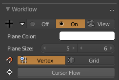
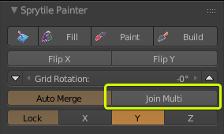

# Advanced Features

This tutorial covers additional Sprytile features not covered in the quick start guide.

## Work Plane Cursor

The work plane is a visual indicator around the Blender cursor which shows the plane you will be painting on, and the fill area when using the fill tool.

There are three options for the display of the work plane cursor:

* Off - Hide the work plane cursor.
* On - Always display the work plane cursor.
* View - Only show the work plane cursor when the view is changed.

These are accessible in Sprytile's workflow panel. There are additional options for the work plane cursor when the foldout is expanded by pressing the triangle on the left.

* Plane Color - Color of the work plane grid.
* Plane Size - Size of the work plane.

### Cursor/Work Plane Navigation

As covered in the quick start tutorial, holding down the `S` key in tile paint mode snaps Blender's cursor to mesh vertices.

Another snapping mode available is grid snapping. This snaps the cursor to the selected tile grid, centered around the cursor. This lets you move the cursor to positions without existing vertices.

You can change between snapping modes via a toggle in the workflow panel.

You can also toggle between snap modes by pressing the `shift` key while holding down `S` to snap the cursor.

While holding down `S`, the work plane can be moved along its axis by scrolling the mouse wheel up or down, letting you easily change layers.

## Sprytile Painter Panel

This section covers features accessible from Sprytile's paint panel.

### Building Off Axis

The build tool is not limited to the global X/Y/Z axis. The `Set Normal` button lets you to pick a normal to use the build tool with.

Paint ground tiles as shown below, with one tile sticking out, and move the 3D cursor to the indicated vertex.

Set the pivot point mode to 3D cursor, and rotate the tile that is sticking out so that its not oriented on the x/y/z axis anymore.

In the Sprytile paint tools, press the `Set Normal` button on the left most side.

Move the mouse cursor back into the scene. The cursor is now a cross, indicating that Sprytile is in Set Normal mode. Left click on the rotated tile.

The axis indicator in the Sprytile panel now shows that it is locked, and Sprytile's tool mode goes back to Build.

With the work plane on, we can see that it is now aligned along the face normal. Use the build tool along this plane.

To go back to using the global X/Y/Z axis for the build tool, deselect the `Lock` button.

### Axis Lock

The `Lock` button can also be pressed without using the `Set Normal` mode.

When pressed, Sprytile's work plane will be locked to the current axis, allowing you to change the viewing angle while working on a consistent plane.

### Multi tile select

While using Sprytile, you may have noticed that you can select multiple tiles in the UI and build/paint with them. This feature allows for greater flexibility while working with tilesets.

However, this can also generate a lot of vertices which may be undesirable. To address this, there is the Join Multi option.

The join multi option will automatically combine multiple selected tiles into one face, making it easier to cleanup or manage triangle counts.

Using this option should be weighed against having the flexibility of having the smaller tiles to modify later on.

### Fill Tool

Sprytile can work with large areas by using the fill tool. In fill mode, the work plane will always be displayed.

The area that can be filled is determined by the work plane size. This can be configured in the paint tools panel under fill mode.

First, switch to fill mode and set the size of your work plane.

Then using grid mode snap, position the work plane to an empty area.

Switch work plane mode to `on` and use the build tool to draw something in the work plane.

Next, pick a different tile and use the fill tool to fill in your drawing.

Note that the fill tool only works on faces that lie on the work plane grid.

Turning on the `Lock Transforms` fill tool option will preserve any tile flips or rotations of the faces that you fill.

### Multiple Materials

Sprytile accommodates multiple materials so that different textures can be used in the scene.

In the tile grid section of the Sprytile panel select the dropdown and press the `New Shadeless Material` option.

!!! bug "Material Renaming"

    If the material name is edited in the Material tab, the tild grid display may say "Invalid Data". Use the `Validate Material Grids` option in the dropdown if this happens.

In Blender's property panel, select the newly created material in the `Material` tab, and then switch to the `Texture` tab to set the texture file.

Go back to the Sprytile tile grid dropdown and select `Setup Pixel Texture` to apply pixel art settings to the texture.

There is now a new tile grid entry in Sprytile's tile grid section for the material. Create, edit, and use tile grids for the new material as usual.

### Additional Tile Grid Settings

Expanding `Extra UV Grid Settings` will allow you to change advanced options for each tile grid.

#### Offset

Offset changes the origin of the tile grid in the tileset texture. This allows for grids of different sizes to be used in one texture without having to find a common denominator to make the grids fit.

The origin of the offset is from the lower left corner of the texture.

#### UV Rotation

Applies a rotation on the tile grids. If you can figure out a cool use for this, let me know!

#### Padding

Padding will give each tile a safe area that can be used to [accomodate texture bleeding](https://itch.io/t/72048/suggestion-for-accomodating-bleeding-fix) in certain game engines.

When starting with a 32x32 tile grid, adding a 1x1 padding will automatically change the tile grid to 30x30.

#### Margins

Some existing tileset have spaces between tiles. The margins settings will let you accomodate for these. 

## Workflow Panel

These are features that appear in Sprytile's workflow panel.

### Reload All Images

After editing a tile set image in an external editor, press this button to quickly reload the texture file.

Additionally, you can toggle the `auto` button to automatically reload textures after they have been edited.

### Make Double Sided

This is only recommended as a step for finishing your model. If your model will be used in a context where double sided faces is not possible or will not be used, certain details may not look right.

This is best demonstrated by turning on backface culling in Blender.

Sprytile has a utility that duplicates faces and flips the normals, effectively turning the face into a double sided face.

This is only recommended as a finishing step because it creates more faces and makes editing the model more difficult.

Select the faces that you want to make double sided, and then go to the Sprytile Utilities dropdown and select `Make Double Sided`.

