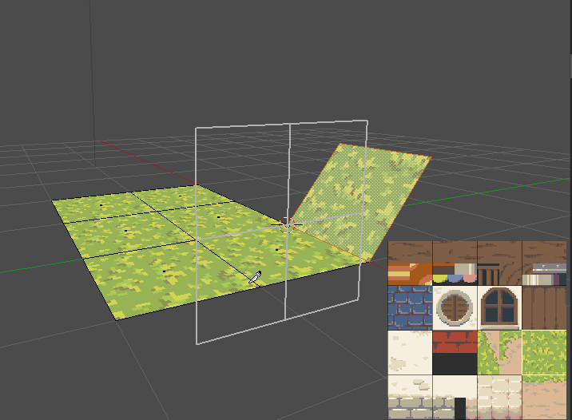
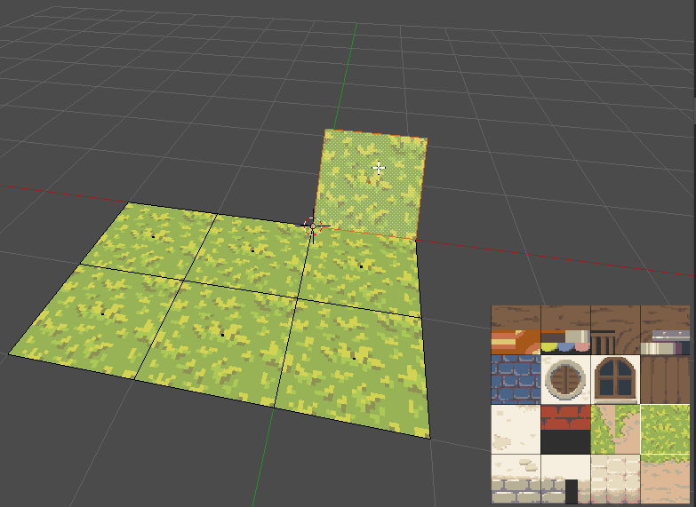
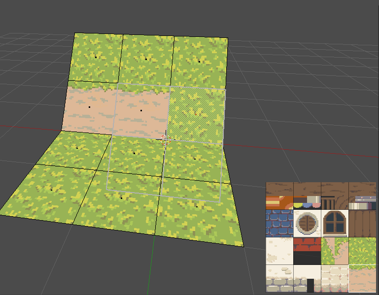
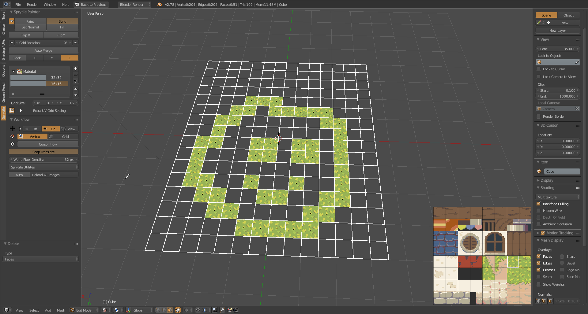
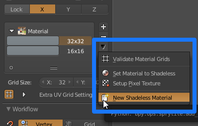
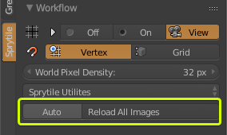
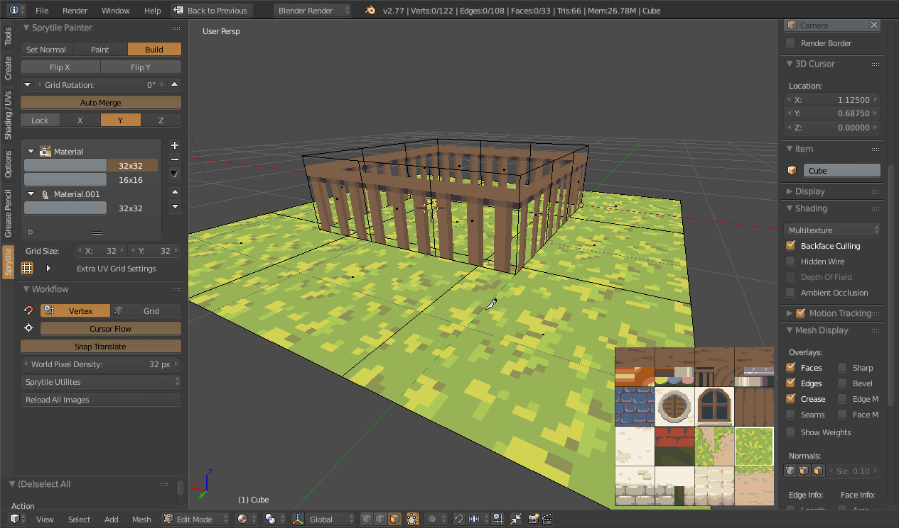

# Advanced Features

This tutorial covers additional Sprytile features not covered in the quick start guide.

## Work Plane Cursor

A feature that was added to Sprytile recently is the Work Plane Cursor. This is a visual indicator around the Blender cursor which shows the plane you will be painting on.

There are three options for the display of the work plane cursor:

* Off - Hide the work plane cursor.
* On - Always display the work plane cursor.
* View - Only show the work plane cursor when the view is changed.

These are accessible in Sprytile's workflow panel. There are additional options for the work plane cursor when the foldout is expanded by pressing the triangle on the left.

* Plane Color - Color of the work plane grid.
* Plane Size - Size of the work plane. This value will always be multiplied by 2.

### Cursor Snap Modes

As covered in the quick start tutorial, holding down the `S` key in tile paint mode snaps Blender's cursor to mesh vertices.

Another snapping mode available is grid snapping. This snaps the cursor to the selected tile grid, centered around the cursor. This lets you move the cursor to positions without existing vertices.

To switch to grid snap mode, you can press the button in the workflow panel.

You can also toggle between snap modes by pressing the `shift` key while holding down `S` to snap the cursor.

## Paint Panel

This section covers features accessible from Sprytile's paint panel.

### Building Off Axis

The build tool is not limited to the global X/Y/Z axis. The `Set Normal` button lets you to pick a normal to use the build tool with.

Paint ground tiles as shown below, with one tile sticking out, and move the 3D cursor to the indicated vertex.

Set the pivot point mode to 3D cursor, and rotate the tile that is sticking out so that its not oriented on the x/y/z axis anymore.

In the Sprytile paint tools, expand the toolbar and press the `Set Normal` button.

Move the mouse cursor back into the scene. The cursor is now a cross, indicating that Sprytile is in Set Normal mode. Left click on the rotated tile.

The axis indicator in the Sprytile panel now shows that it is locked, and Sprytile's tool mode goes back to Build.

Use the build tool. The faces are now being created on the chosen normal.

To go back to using the global X/Y/Z axis for the build tool, deselect the `Lock` button.

### Axis Lock

The `Lock` button can also be pressed without using the `Set Normal` mode.

When pressed, Sprytile's work plane will be locked to the current axis, allowing you to change the viewing angle while working on a consistent plane.

### Fill Tool

Sprytile can fill large areas by using the fill tool. Expand the tools foldout to access the fill tool. In fill mode, the work plane cursor will always be displayed.

The area that can be filled is determined by the work plane size. This can be configured in the paint tools panel under fill mode.

First, switch to fill mode and set the size of your work plane.

Then using grid mode snap, position the work plane cursor to an empty area.

Switch work plane mode to `on` and use the build tool to draw something in the work plane.

Next, pick a different tile and use the fill tool to fill in your drawing.

Note that the fill tool only works on faces that lie on the work plane grid.

Turning on the `Lock Transforms` fill tool option will preserve any tile flips or rotations of the faces that you fill.

### Multiple Materials

Sprytile accommodates multiple materials so that different textures can be used in the scene.

In the tile grid section of the Sprytile panel select the dropdown and press the `New Shadeless Material` option.

!!! bug "Material Renaming"

    If the material name is edited in the Material tab, the tild grid display may say "Invalid Data". Use the `Validate Material Grids` option in the dropdown if this happens.

In Blender's property panel, select the newly created material in the `Material` tab, and then switch to the `Texture` tab to set the texture file.

Go back to the Sprytile tile grid dropdown and select `Setup Pixel Texture` to apply pixel art settings to the texture.

There is now a new tile grid entry in Sprytile's tile grid section for the material. Create, edit, and use tile grids for the new material as usual.

### Additional UV Grid Settings

Expanding `Extra UV Grid Settings` will allow you to change extra options for each tile grid.

#### Offset

Offset changes the origin of the tile grid in the tileset texture. This allows for grids of different sizes to be used in one texture without having to find a common denominator to make the grids fit

#### UV Rotation

Applies a rotation on the tile grids. If you can figure out a cool use for this, let me know!

## Workflow Panel

These are features that appear in Sprytile's workflow panel.

### Reload All Images

After editing a tile set image in an external editor, press this button to quickly reload the texture file.

Additionally, you can toggle the `auto` button to automatically reload textures every few seconds.

### Cursor Flow

While using Sprytile's build tool the 3D cursor will normally stay in place. Turning on cursor flow will make the 3D cursor follow the direction you are building in.

This can be helpful for roughing in structure in an intuitive manner.

### Make Double Sided

This is only recommended as a step for finishing your model. If your model will be used in a context where double sided faces is not possible or will not be used, certain details may not look right.

This is best demonstrated by turning on backface culling in Blender.

Sprytile has a utility that duplicates faces and flips the normals, effectively turning the face into a double sided face.

This is only recommended as a finishing step because it creates more faces and makes editing the model more difficult.

Select the faces that you want to make double sided, and then go to the Sprytile Utilities dropdown and select `Make Double Sided`.

