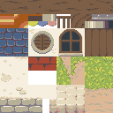

# Quick Start Tutorial #

This is a short tutorial on how to install and use Sprytile. We'll be using the following tile set image for this tutorial, but feel free to use your own tileset to follow along.

## Installation ##

Download the zip file from the [Sprytile page](https://chemikhazi.itch.io/sprytile).

In Blender, open User Preferences by going to `File > User Preferences`. Go to the Add-ons tab and press  `Install from File` at the bottom of the preference window and navigate to the downloaded zip file. After installation, search for Sprytile under Community addons and enable it.

!!! note "Save User Settings"

    Press the `Save User Settings` if you want to continue using Sprytile in future Blender sessions.

With Sprytile installed, let's start a new Blender file by going to `File > New`. Make sure the tool shelf panel to the left of the 3D view is open. If it is not, press `T` and find the Sprytile tab. If the Sprytile tab is missing, check the installation steps again.

## Material Setup ##

Before using the Sprytile tools, the tile set has to be loaded into the material. With a mesh object selected, go to the Materials tab in the Properties View, then press `Set Material to Shadeless` in the Sprytile panel.

Next, go to the Textures tab in the Properties view and load your tile set image into the material. Go back to the Sprytile tab and press `Setup Pixel Texture`.

## Sprytile Tools ##

The majority of Sprytile tools are accessed under `Edit Mode`. With a mesh object selected, enter edit mode and open the tool shelf to the Sprytile tab. Press `T` to open the tool shelf if it is hidden from the left of the 3D view.

!!! tip "Pixel Density"

    If you're not using the provided tile set, you might want to change the world pixel density setting. This determines how many pixels fit inside one Blender unit. The provided tile set is based around 32x32 pixel tiles.

## Build Tool ##

The build tool creates mesh faces in the editor that are UV mapped to the selected tiles. Open Sprytile's tile map mode by pressing the `Build` button. You will notice the tile selection UI popup on the lower right corner of the 3D view, indicating that tile map mode is active.

Exit tile map mode by pressing the `Build` button again or by pressing the `Esc` key. Pressing `Ctrl + Shift + Space` on the keyboard will activate tile map mode again.

!!! note "Tile Selection UI"

    The tile selection UI lets you pick the tile you will be painting with. Zoom the UI by hovering over it and scrolling your mouse wheel up or down.

### Tile Building Workflow ###

Now to get familiar with Sprytile's workflow by building something! First, delete the existing vertices of the selected mesh so we have a blank slate.

The workflow of Sprytile revolves around Blender's 3D cursor and the direction the 3D view is facing.

The 3D cursor is the center of the tile grid when you're painting, and the global axis that the view is facing is the surface you will be painting on.

As an example, reorient the 3D view so that it is facing the floor of the file, and then set the 3D cursor to the center by pressing `Shift + S` and selecting `Cursor to Center`.

In the tile selection UI, choose the grass tile and paint around the 3D cursor. Notice how the tile grid is centered on the 3D cursor and the painting surface is oriented to the ground.

Now reorient the 3D view so it is facing one of the side facing global axis. Pick a wall tile and paint with the tile. Notice how the tiles are being created on a grid centered on the 3D cursor but now in a perpendicular direction.

!!! info "Axis Indicator"

    While tile map mode is activated, the axis indicator in the Sprytile Painter panel will update to show you which axis the tiles will be painted on.

Since the 3D cursor is an important part of the Sprytile workflow, you can quickly reposition the cursor to the vertex nearest the mouse cursor by holding down the `S` key while in tile map mode. To make navigation easier as well, pressing the `W` key will center the 3D view around the cursor.

Try moving the 3D cursor to a different position by holding down the `S` key and then reorienting the 3D view to face the last axis you have yet to paint on. Paint on that axis. Note that the center has moved to where you have positioned the cursor.

!!! bug "Beta software!"

    Sprytile is still in beta. If Sprytile stops responding during this tutorial, use the reset function under the utilities dropdown.

    

### Tile Grids ###

### Tile Flip/Rotation ###

## Pixel Grid Translate ##

## Paint Tool ##
