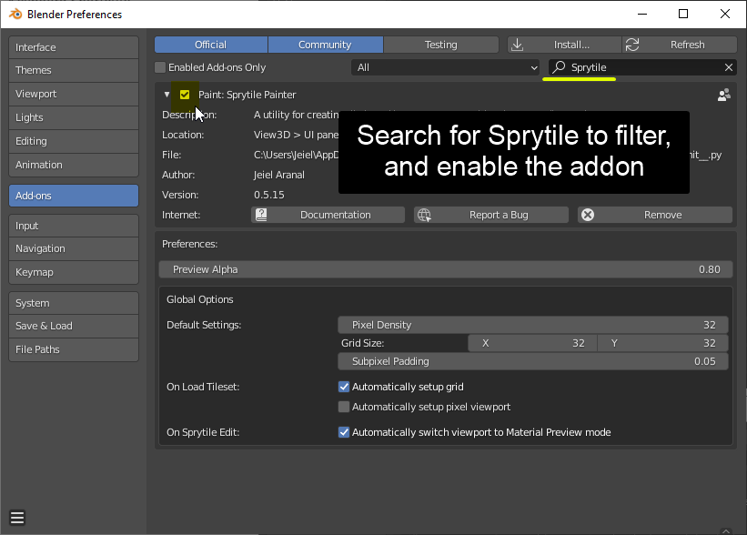
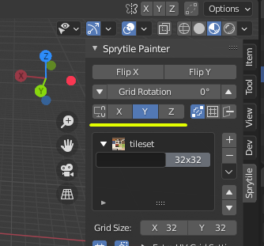
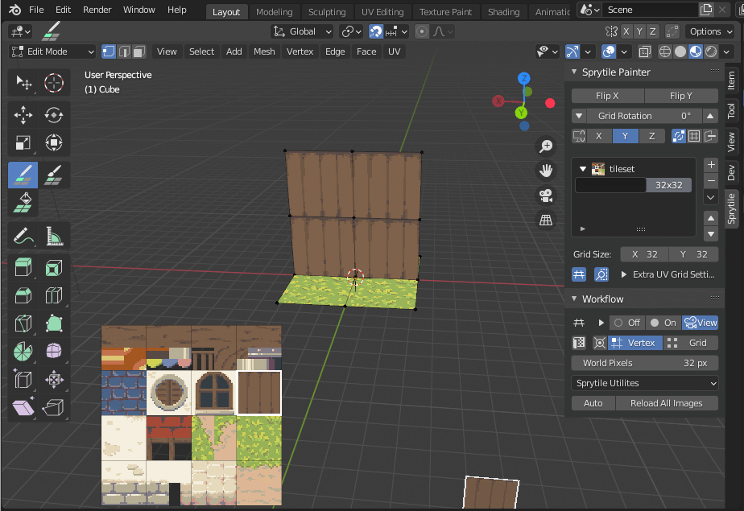
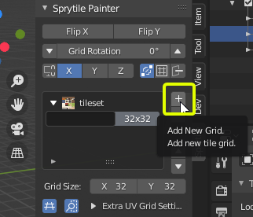
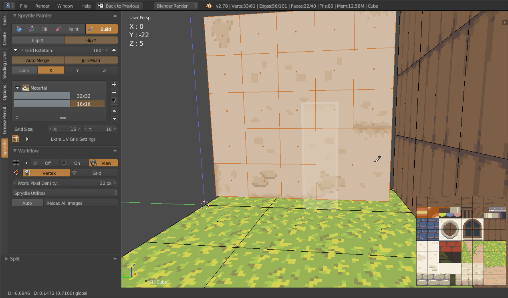
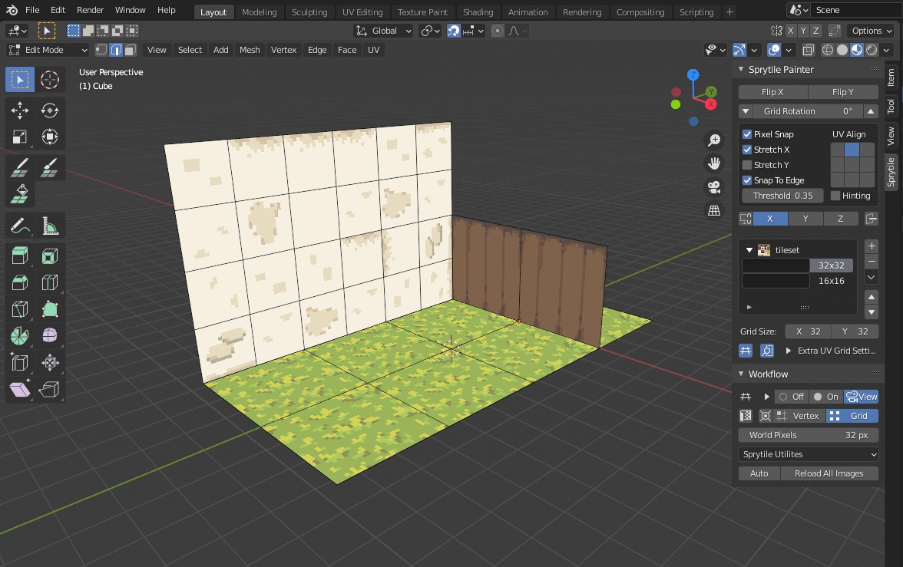
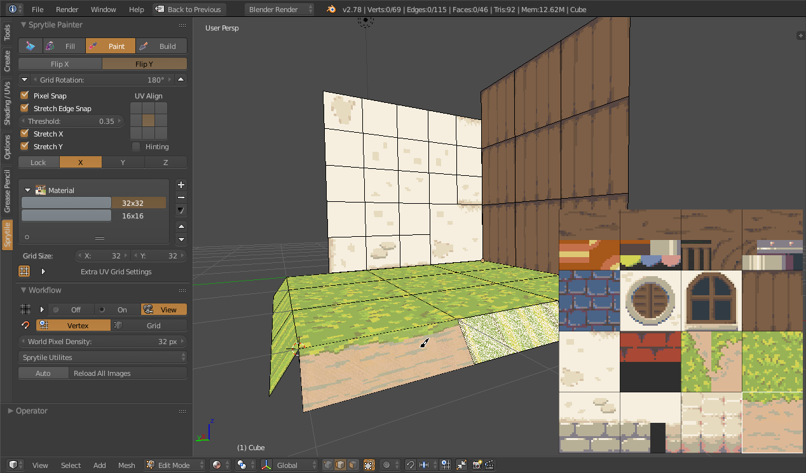
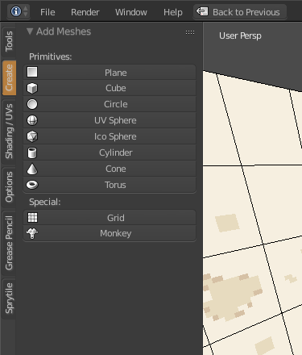
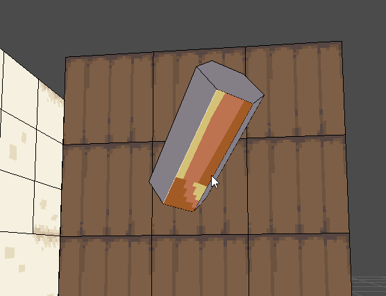

# Quick Start Tutorial #

This is a short tutorial on how to install and use Sprytile, an open source tile map editor addon for Blender.

We'll be using the following tile set image for this tutorial, but feel free to use your own tileset to follow along.

You can also follow along with the [video tutorial](<https://youtu.be/-ezYZgMp-R0>)

## Installation ##

Download the zip file from the [Sprytile page](https://chemikhazi.itch.io/sprytile).

In Blender, open User Preferences by going to `File > User Preferences`. Go to the Add-ons tab and press  `Install from File` at the bottom of the preference window and navigate to the downloaded zip file. After installation, search for Sprytile under Community addons and enable it.

To make sure Blender shows pixel art textures correctly, we have to turn off mipmaps in 3D view. In the preferences window, switch over to the `System` tab and turn off the Mipmaps option under OpenGL.

Next, make sure that Blender is using the Blender Renderer by going back to the main window and checking the renderer dropdown near the top.

With Sprytile installed and setup, let's start a new Blender file by going to `File > New`. Make sure the tool shelf panel to the left of the 3D view is open. If it is not, press `T` and find the Sprytile tab. If the Sprytile tab is missing, check the installation steps again.

!!! note "Future Uses"

    Press the `Save User Settings` button if you want to continue using Sprytile in future Blender sessions without going back to User Preferences

## Material and Tileset Setup ##

Before using the Sprytile tools, the tile set has to be loaded into the material. With a mesh selected in object mode, go to the Sprytile panel and press `Load Tileset`. Choose the tileset texture here and the material and texture are automatically setup and ready to go.

!!! note "Pixel art material"

    The material setup here is for pixel art style textures. Advanced users of Blender may want to modify the material for other purposes.

## Sprytile Tools ##

The majority of Sprytile's tools are accessed under `Edit Mode`. With a mesh object selected, enter edit mode and open the tool shelf to the Sprytile tab. Press `T` to open the tool shelf if it is hidden from the left of the 3D view. Expand the tool shelf if it is too cramped.

!!! tip "Pixel Density"

    If you're not using the provided tile set, you might want to change the world pixel density setting. This sets how many pixels fit inside one Blender unit. The provided tile set is based around 32x32 pixel tiles.

!!! tip "Backface Culling"

    It is recommended to turn off backface culling so you can see the direction the faces are being built in. This is accessible in the right hand panel of the viewport (press 'n' if it is not visible), under the shading foldout.

## Build Mode ##

The build tool creates mesh faces that are UV mapped to the selected tiles. Open Sprytile's tile map mode by pressing the `Build` button. You will notice the tile selection UI popup on the lower right corner of the 3D view, indicating that tile map mode is active.

Exit tile map mode by pressing the `Build` button again or by pressing the `Esc` key. Pressing `Ctrl + Shift + Space` on the keyboard will activate tile map mode again.

!!! note "Tile Selection UI"

    The tile selection UI lets you pick the tile you will be painting with. Zoom the UI by hovering over it and scrolling your mouse wheel up or down.

### Tile Building Workflow ###

Now to get familiar with Sprytile's workflow by building something!

First, delete the existing vertices of the selected mesh so we have a blank slate. Do this by pressing `a` to select all, and then pressing `x` and selecting `Vertices`.

The workflow of Sprytile revolves around Blender's 3D cursor and the direction the 3D view is facing.

The 3D cursor is the center of the tile grid when you're painting, and the global axis that the view is facing is the surface you will be painting on.

Let's start by reseting the 3D cursor to the center of the scene by pressing `Shift + S` and selecting `Cursor to Center`.

With the tile selection UI open, try rotating the 3D view camera around. Hold down the middle mouse button while the mouse cursor is in the 3D view and move the mouse.

Notice that a grid appears around the blender 3D cursor. This is called the work plane and indicates the plane that you'll be building on.

By default, the work plane appears when the view camera is panned. If it does not, [check the settings](advanced-features/#work-plane-cursor).

Tilt the camera downwards so that the work plane is aligned to the ground.

In the tile selection UI, choose the grass tile and paint around the 3D cursor. Notice how the tile grid is centered around the 3D cursor and the painted tiles appear on the ground.

Now pan the camera up so the work plane is vertical. Pick a wall tile and paint with the tile.

!!! info "Axis Indicator"

    While tile map mode is activated, the axis indicator in the Sprytile Painter panel will update to show you which axis the tiles will be painted on.

    

Since the 3D cursor is an important part of the Sprytile workflow, you can quickly reposition the cursor to the vertex nearest the mouse cursor by holding down the `S` key while in tile map mode. To make navigation easier, pressing the `W` key will center the 3D view around the cursor.

Try reorienting the 3D view to face the last axis you have yet to paint on, then moving the 3D cursor by holding down the `S` key and moving your mouse. Paint on that axis. Note that the center of the grid has moved to where you have positioned the cursor.

!!! bug "Beta software!"

    Sprytile is still in beta. If Sprytile stops responding during this tutorial, use the reset function under the utilities dropdown.

    

### Tile Grids ###

Now that you know how to use Sprytile, let's focus on tile grids. Tile maps might be made up of tiles in different scales. To account for this, Sprytile allows you to paint tiles in different sizes. This part of the Sprytile panel allows you to create and organize the grid settings used with the tile map.

Press the `+` button at the panel and select the newly created entry. The settings for this new tile grid can be changed in the boxes below. For this tile grid, lets change it to a 16 x 16 tile size.

You can see that the tile selection UI updates to show the currently selected tile grid as well. You can change the tile grid selection by using the tile grid selector in the tools panel.

You can also change tile grids by holding `Ctrl` with your mouse over the tile selection UI and scrolling the mousewheel up or down.

### Tile Flipping/Rotation ###

Looking closely at the last wall we created, we can see that the texture gets very repetitive. Delete part of that wall and recreate the wall using the 16x16 tile grid. By using the smaller grid, we can break up the pattern created by the larger tile size.

But even with the smaller tiles, the repetition is still visible. With tile map editors, you can further break up the patterns by rotating and flipping tiles. To do that, we use this part of the Sprytile panel.

The keyboard shortcuts for rotating tiles left and right are the `1` and `2` keys.

The `3` key toggles Flip X and the `4` key toggles Flip Y.

Repaint the wall using the tile flipping and rotation options.

!!! info "Tile Picker"

    You can pick tiles from your scene like in Photoshop. Hold down the `alt` key and select a tile from the scene with a left mouse click.

## Pixel Translate ##

This wall is placed in an awkward position. Sprytile makes moving faces easier in tile map mode by constraining movement to the pixel grid. Select the wall faces and split them by pressing the `Y` key. Now translate the selection by pressing the `G` key. The movement snaps to the pixel grid and a readout showing the movement is shown on the top left corner.

!!! info "Build Mode Automerge"

    It's necessary to split the faces because build mode automatically merges close vertices by default. You can turn off this option by toggling `Auto Merge` beneath the tile rotation/flip section.

Use the pixel translation tool to move the wall to a more sensible place. The movement is restricted along the work plane, so rotate the 3D view when necessary. Pixel translate is automatically used when in tile map mode.

!!! note "Snap Translate Vertices"

    By default, pixel translate will snap the selected vertices to the pixel grid around the 3D cursor. This can be turned off using the `Snap Translate` option in the Workflow panel.

## Paint Mode ##

Finally, we'll cover paint mode. Paint mode gives you tools to quickly UV map faces to tiles, allowing you to build your mesh with other Blender tools. Let's extrude the edges of the grass without using tile map mode so that the geometry isn't on the pixel grid anymore.

Next, turn on paint mode by pressing the `Paint` button in the Sprytile panel. Using the 32x32 tile grid, select the tile that is the border of the grass and the ground.

Now try painting the tile on one of the extruded faces. The texture appears stretched because of the current paint settings.

Change the paint settings to the following and try painting the faces again.

Now the grass/ground boundary appears because UV mapping of the face is being aligned to the top of the tile. Continue painting the other extruded faces.

### Advanced Painting ###

Paint mode allows for easy UV mapping even when the face is not aligned to the global XYZ axis. Using the create tab, make a low poly
cylinder and rotate it so it is not aligned to the global XYZ axis.

Switch to the 16x16 tile grid and select the following tile. Make sure that grid rotation is back at 0 and that Flip X and Y are off.

If you try painting the outer faces of the cylinder, you will notice that the alignment of the UV is not correct. To fix this, we can use hinting mode. Toggle on hinting in the Sprytile panel.

Switch to edge selection mode and select one of the cylinder's edges along the long side. Then paint on the faces connected to the selected edge and notice that the UV mapping is now properly aligned to the face.

What hinting does is indicate to Sprytile which side of the face will be aligned to the horizontal axis of the tile map.

The cylinder still doesn't look like our selected tile. To fix this, we can use the stretch options on the paint tool.

With the stretch options on, repeat painting the faces as with the previous step. Now the faces will be UV mapped with the selected tile stretched out over each face, looking more like the metallic pipe of the selected tile.

## Conclusion ##

This tutorial gives an overview of Sprytile's basic functions, hopefully enough to help you to build cool things with it.

For more advanced uses of Sprytile, check the [Advanced Features](advanced-features) tutorial page.

If you have any questions, feel free to contact me on [twitter](https://twitter.com/chemikhazi) or via the [itch.io discussion boards](https://chemikhazi.itch.io/sprytile/community).
