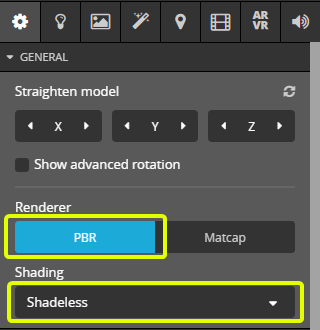
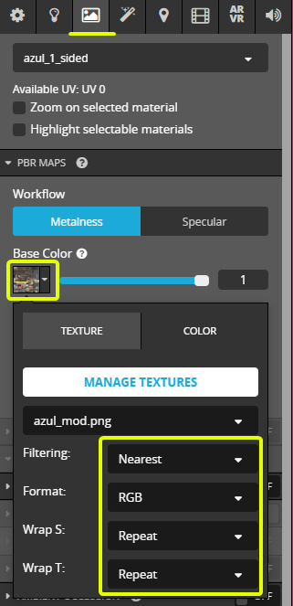

# Exporting for Sketchfab

Sketchfab is an online service that allows you to showcase your 3D work inside a browser. There is a collection of [models made with Sprytile](https://sketchfab.com/ZeroByte/collections/made-with-sprytile) that I curate on Sketchfab.

These are settings I've found to be a good base for making your low poly pixel art texture models look good in [Sketchfab](https://sketchfab.com/). Think of this as a base, there are additional ways to make presenting your models more eye catching in Sketchfab!

## Power of Two Textures

If you've read the previous guides, you may know by now how important it is [to have power of two sized textures](creating-tilesets#power-of-two-sizes) for your 3D models, and it is especially important with Sketchfab.

The technology used by Sketchfab to display models is sensitive to sizes and non power of two textures will have artifacts no matter how closely you follow the rest of this guide.

There are workarounds to this limitation if necessary, but it will always result in some artifacts.

## Upload to Sketchfab

Sketchfab will accept Blender files as uploads from their web interface.

## Sketchfab 3D Settings

Once you've exported your model from Blender to Sketchfab, go to the sketchfab website in your browser and edit the 3D settings for your model.

First, set the renderer type to `PBR`, and shading to `Shadeless`.

Next, go to the Materials tab, and in the PBR Maps settings expand the Base Color dropdown to get to texture settings. Set filtering to `Nearest`, format to `RGB`, and both wrap settings to `Repeat`

Next, scroll down to the **Opacity** settings and turn it on. Set it to `Mask` and turn the slider up to 1. Expand the textures again and make sure the filter, format, and wrap settings are correct.

---

These settings provide a good base for the low poly pixel art style of 3D. You can experiment with the how you present your models by playing with the [post processing effects on Sketchfab](https://blog.sketchfab.com/tuning-sketchfab-post-processing/), or even trying out animations.

## Non Power of Two Workaround

If your texture cannot be power of two, one thing you can do is to scale up the texture by 2x, 3x, or 4x in an image editor. This will result in a larger texture, but may hide some of the artifacts caused by smaller non power of two sized textures.