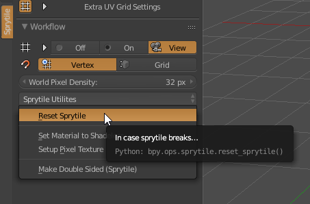
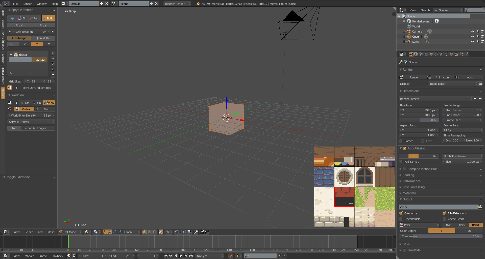
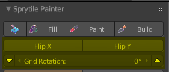

# Sprytile Basics

We'll now go into the basic steps of using Sprytile. If you're new to Blender, you might want to read the [Blender basics tutorial](blender-basics.md) first.

By the end of this tutorial, we'll have:

* Created a simple 3D house using 2D tiles
* Familiarized ourselves with the Sprytile workflow.

We'll be using the following tileset image for this tutorial, save the image to your drive to follow along.

Note that this tileset is 128x128 pixels and follows the [power of two technical requirement](tutorial/tilesets) for textures in 3D.

For this tutorial, we'll start over from a new Blender scene. Open Blender and you will see the default scene. If you already have Blender open, you may want to go to `File>New` to start over with a new scene.

Make sure that the mesh object selected by right clicking on the cube in the scene. Now check that Blender is in Object Mode and go to the Sprytile tab in the tool shelf.

## Tileset Setup

The first thing we need to do is to setup the material and load the tileset texture into Blender. With the cube mesh object selected, go to the Sprytile tab, press the `Load Tileset` button under Material Setup.

Choose the texture of the tileset in the file selector that pops up and the material and texture will automatically be setup, ready for use with Sprytile.

!!! note "Pixel art material"

    The material setup here is for pixel art style textures. Advanced users of Blender may want to modify the material for other purposes.

## Sprytile Tools

The majority of Sprytile's tools are accessed under Blender's `Edit Mode`. With the cube selected, enter edit mode and open the tool shelf to the Sprytile tab.

If you do not see the tool shelf in the left of the 3D view, press `T` to show the tool shelf. Expand the tool shelf if it is too cramped. 

!!! tip "Backface Culling"

    It is recommended to turn off backface culling so you can see the direction the faces are being built in. This is accessible in the right hand panel of the viewport (press 'n' if it is not visible), under the shading foldout.

### Reset Sprytile

Before going further, Sprytile is still new software and you may encounter some bugs. If you experience a crash, try to `Reset Sprytile` under the utilities dropdown.

## Build Tool

The build tool creates mesh faces that are UV mapped to the selected tiles. Open Sprytile's tile map mode by pressing the `Build` button. You will notice the tile selection UI popup on the lower right corner of the 3D view, indicating that tile map mode is active.

Exit tile map mode by pressing the `Build` button again or by pressing the `Esc` key. Pressing `Ctrl + Shift + Space` on the keyboard will activate tile map mode again.

!!! note "Tile Selection UI"

    The tile selection UI lets you pick the tile you will be painting with. Zoom the UI by hovering over it and scrolling your mouse wheel up or down.

### Tile Mapping

Let's familiarize ourselves with Sprytile's by building something.

First, delete the existing vertices of the selected mesh so we have a blank slate. Do this by pressing `a` to select all, and then pressing `x` and selecting `Vertices`.

Sprytile's workflow revolves around Blender's 3D cursor and the direction the 3D view is facing. The 3D cursor is the center of the tile grid when you're painting, and the global axis that the view is facing is the surface you will be painting on.

Let's start by reseting the 3D cursor to the center of the scene by pressing `Shift + S` and selecting `Cursor to Center`.

With the tile selection UI open, try rotating the 3D view camera around. Hold down the middle mouse button while the mouse cursor is in the 3D view and move the mouse.

Notice that a smaller grid appears around the blender 3D cursor. This is called the work plane and indicates the plane that you'll be building on.

By default, the work plane appears when the view camera is panned. If it does not, [check the settings](../advanced-features/#work-plane-cursor).

Tilt the camera downwards so that the work plane is aligned to the ground.

In the tile selection UI, choose the grass tile and paint around the 3D cursor. Notice how the tile grid is centered around the 3D cursor and the painted tiles appear on the ground.

Now pan the camera up so the work plane is vertical. Pick a wall tile and paint with the tile.

!!! info "Axis Indicator"

    While tile map mode is activated, the axis indicator in the Sprytile Painter panel will update to show you which axis the tiles will be painted on.

    

Since the 3D cursor is an important part of the Sprytile workflow, you can quickly reposition the cursor to the vertex nearest the mouse cursor by holding down the `S` key while in tile map mode. To make navigation easier, pressing the `W` key will center the 3D view around the cursor.

Try reorienting the 3D view to face the last axis you have yet to paint on, then moving the 3D cursor by holding down the `S` key and moving your mouse. Paint on that axis. Note that the center of the grid has moved to where you have positioned the cursor.

### Tile Grids

Now that you know how to build with Sprytile, let's focus on tile grids. Tilesets might be made up of tiles in different scales. To account for this, Sprytile allows you to work with grids of different sizes. This part of the Sprytile panel allows you to create and organize the tile grids.

Press the `+` button at the panel and select the newly created entry. The settings for this new tile grid can be changed in the boxes below. For this tile grid, lets change it to a 16 x 16 tile size.

You can see that the tile selection UI updates to show the currently selected tile grid as well. You can choose the tile grid settings being used by using the tile grid selector in the tools panel.

You can also change tile grids by holding `Ctrl` with your mouse over the tile selection UI and scrolling the mousewheel up or down.

### Flip/Rotate Tiles

Looking closely at the last wall we created, we can see that the texture gets very repetitive. Delete part of that wall and recreate the wall using the 16x16 tile grid. By using the smaller grid, we can break up the pattern created by the larger tile size.

But even with the smaller tiles, the repetition is still visible. With tile mapping, you can further break up the patterns by rotating and flipping tiles. To do that, we use this part of the Sprytile panel.

The keyboard shortcuts for rotating tiles left and right are the `1` and `2` keys.

The `3` key toggles Flip X and the `4` key toggles Flip Y.

Rebuild the wall using the tile flipping and rotation options. You can also select multiple tiles to build with by drag selecting in the tile selection UI.

### Picking Tiles

You can also pick tiles directly from your scene like in Photoshop. Hold down the `alt` key and select a tile from the scene with a left mouse click.

## Vertex Management

Building models with a tiles may generate more vertices than is strictly needed. Sprytile has options to manage vertices, but using them may give you less flexibility. Keep these options in mind when building your models with Sprytile.

### Auto Merge

The `Auto Merge` option will automatically join the vertices between tiles. When using this option, you will not be able to as quickly move individual tiles around after building with them.

### Join Multi

The `Join Multi` option helps when using the multi tile selection. Without this option, the tiles that are created will be made up of multiple faces. With Join Multi on, the build tool will only create one face.

## Paint Tool

### Tile Alignment

### Tile Stretch

## Fill Tool

## Set Normal